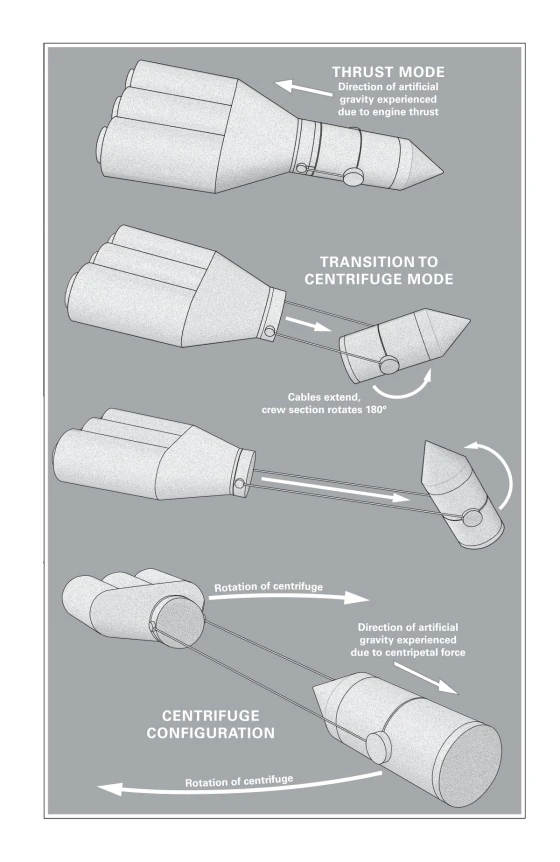

# Project Hail Mary
## Autor : **Andy Weir** | Primeira publicação : **04/05/2021**
## Início da leitura : 25/04/2026 | Término da leitura : XX/XX/XXXX
---
### Capítulo 01
- Logo de cara : o design original da nave é bem mais feio do que aparece no filme. Legitimamente parcendo algo que uma pessoa construiria no Kerbal Space Program no seu primeiro save. O modo de centrifugação continua sendo bem legal, incrivelmente.
	
	
	*Nave original*
	
	
	*Nave do filme*

- Setup para o personagem principal se levantar e entender *o mínimo* do que está acontecendo ao redor dele é mais extenso. Mais ou menos o mesmo que acontece no filme, só que bem mais provável. Ryan Gosling consegue se levantar de **imediato** filme, demora um poquinho mais no livro.
- A linha de Petrova é introduzida de maneira semelhante, com pequenos flashbacks que o personagem não consegue se lembrar exatamente do porque eles de repente está tendo flashbacks.
- Ele também consegue se lembrar quem eram os outros dois tripulantes.
	- Ele assume que estavam em alguma câmara de quarentena.
- **Nada** indica que eles estão no espaço.
- Ele percebe que é um homem branco e que fala inglês, não lembrando de seu nome, quando o braço robô o pergunta por ele o personagem reponde **J-John?**
	- Loud incorrect buzzer.
- Ao decorrer do capítulo ele tenta abrir a escotilha no topo da sala mas acaba caindo das escadas de mão. Ele comenta depois que a queda dele parecia *errada*. Fazendo alguns experimentos depois com alguns tubos de ensaio que encontrou no laboratório, analisando sua velocidade após ter sido empurrado na mesa (repetindo esse experimento umas 20 vezes) ele descobre que a gravidade nesse lugar é de **$15m/s$**. A gravidade local da Terra é de **9m/s.**
- O personagem termina o capítulo acreditando não estar mais na Terra.

---
### Capítulo 02
- Ele, obviamente, se desespera, quase não conseguindo acreditar no próprio experimento. Seu primeiro raciocínio é acreditar que está numa **centrífuga gigante**.
	- Ele testa essa suposição fazendo outro experimento científico usando um fio de nylon para criar um pequeno pêndulo para observar o seu balanço. Ele aponta que o período do pêndulo é regido por apenas dois fatores : **O comprimento do pêndulo & Gravidade**.
	- Tendo feito o experimento em duas salas diferentes, ele descarta a ideia de estar em uma centrífuga gigante. Isso pois, caso estives em uma, a gravidade seria mais forte nas extremidades. Não é.
- O personagem principal continua tendo seus flashbacks, agora tendo um sobre um pequeno encontro que teve com sua amiga **Marissa** em um bar que costumavam ir juntos no happy hour.
	- Nele, a Marissa é a primeira a informar o personagem principal do verdadeiro perigo da Linha de Petrova, coisa que ele tinha simplesmente lido em um newsletter que tinha assinado no capítulo anterior. Uma linha que conecta Vênus com o Sol que emite um sinal fraco de luz infra-vermelha, a Linha de Petrova parece estar 'sugando' energia solar de acordo com um satélite da agência espacial Japonesa.
		- "*A emissão solar vai cair 1% nos próximos nove anos. Nos próximos vinte anos, a queda será de 5%. Isso é ruim. Muito ruim.*"
		- "*Isso significa uma era glacial. Tipo... agora. Uma era glacial instantânea.*"
- Em outro flashback, o lançamento do satélite **AcLight** praticamente confirma que a Linha de Petrova contém vida alienígena, microscópica, mas legal.
	- Digo, desconsiderando o fato que estão devorando o Sol.
- O computador da nave alera o personagem principal de uma **Anomalia angular** antes do coma terminar propriamente.
- Talvez a parte mais engraçda do capítulo, parece que o tom cômico não foi algo que o Lord & Miller implantaram no filme :
	- "*Eu gosto de crianças. Hum. Tenho essa sensação. Mas eu gosto de crianças. Elas são legais. É divertido passar tempo com elas.*"
	- "*Então, eu sou um solteiro de trinta e poucos anos, que mora sozinho em um apartamento pequeno, não tenho filhos, mas gosto muito de crianças. Não estou gostando nada da conclusão...*"
	- "*Professor! Sou professor de escola! Eu me lembro agora!*"
	- "*Ai, graças a Deus. Sou professor.*"

---
### Capítulo 03
- Capítulo começa com o Grace voltando às aulas depois da descoberta do satélite ArcLight. Ele comenta que :
	"*A situação era desesperadora e mortal, mas também era a realidade.*"
- O que é incrível lembrar que o livro lançou em 2021. Nada acontece por acaso.
- O filme começa com mais ou menos essa mesma cena, com o Grace jogando o saquinho de feijões pela turma pra uma sessão relâmpago de perguntas & respostas.
- A segunda parte dessa 'cena' é, se não semelhante, idêntica ao que acontece no filme, a Stratt enfrenta o Grace e "pede" (as much as the shadow government can) pela assistência dele para analisar o que encontraram na linha de Petrova.
	- O filme adaptou tão 1:1 a cena que a única coisa que me chamou a atenção foi o fato que a Stratt é revelada posteriormente como Holandesa. No filme ela cita que quando criança cantava no coral de alguma igreja na Alemanha Oriental. O que seria bem engraçdo ter uma personagem principal que tem chance não 0 de ter trabalhado pra **Stasi**.
- 
