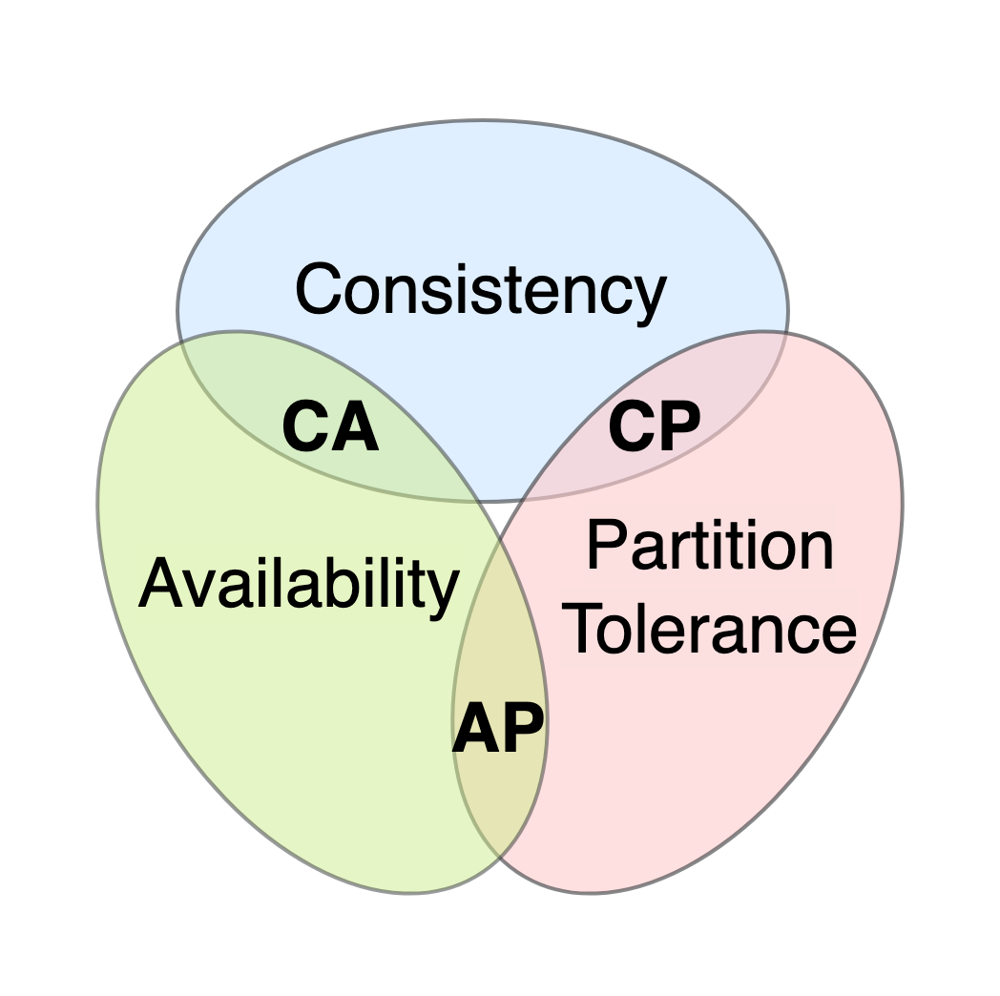

# Engenharia de Software II - Resolução atividades de revisão P1.
## [07-05-2026][mvfm]

## Prefácio
Esse arquivo contém minha resolução das atividades disponíveis no [seguinte arquivo](./revisaop1.pdf). Uma simples revisão, levando em consideração que esse foi o único conteúdo entregue que contém atividades práticas.

---
### Questão n01 
- **Q :** A respeito dos estilos e padrões arquiteturais contidos na engenharia de software, avalie as afirmações a seguir.
	- **R :** As afirmações
		1. **Em arquiteturas orientadas a objetos, a comunicação entre os componentes do software é realizada por intermédio da troca de mensagens.**
		3. ** No padrão arquitetural Modelo-Visão-Controle (MVC), a camada de Modelo representa dados associados às interações realizadas no Controle, podendo ser apresentados/manipulados posteriormente na Visão.** 
	- Estão corretas, portanto a alternativa correta é : **Alternativa a)**

### Questão n02
- **Q :** A tendência de desenvolver aplicações que possam ser utilizadas em nuvem otimiza o desempenho de máquinas locais, munidas de poucos recursos computacionais, em uma rede e garante a possibilidade desses computadores utilizarem outros recursos computacionais de maior desempenho, bem como a inserção de novos hosts neste ambiente computacional, sem comprometimento do sistema como um todo.
	- **R :** O cenário descreve máquinas locais com poucos recursos (clientes) utilizando recursos computacionais poderosos remotos (servidores), com escalabilidade horizontal via adição de novos hosts. Esse é o modelo **cliente-servidor**. A alternativa correta é a **Alternativa d)**
		- Alternativa d) cliente-servidor

### Questão n03
- **Q :** Acerca da arquitetura de microsserviços, assinale a opção correta.
	- **R :** Outra questão bem direta, a alternativa correta é a **Alternativa b)** de novo.
		- Alternativa b)  A comunicação entre os microsserviços é feita por meio de mecanismos padrões de tecnologia, como, por exemplo, o REST (representational state transfer).

### Questão n04
- **Q :** Aponte dois benefícios e dois desafios do uso de monolitos. Após isso, aponte dois benefícios e dois desafios do uso de microsserviços.
	- **R :** Talvez a questão mais fácil, na [Aula 03](es2/aula03.md) Júlio tinha nos mostrado um gráfico que responde direto.

| Arquitetura | Vantagens | Desvantagens |
|-------------|-----------|--------------|
| Monolitos | Requer menos planejamento no início. Baixo investimento inicial. | Pequenas mudanças introduzem riscos maiores. Cada vez mais complexo de entender e manter. |
| Microsserviços | Fica mais fácil de gerenciar e manter com o tempo. Possível a modificação de microsserviços individuais sem afetar toda a aplicação. | Investimento adicional de tempo e custo para configurar a infraestrutura necessária. Requer ferramentas avançadas de depuração. |

### Questão n05
- **Q :** Usualmente, os aplicativos monolíticos têm bancos de dados monolíticos. Um dos princípios de uma arquitetura de microsserviços é ter um banco de dados para cada microsserviço. Portanto, ao modernizar o aplicativo monolítico para microsserviços, você precisa dividir o banco de dados monolítico com base nos limites do serviço identificados. No entanto, dividir um banco de dados monolítico é complexo porque pode não haver uma separação clara entre os objetos do banco de dados. Além desse desafio, quais outros problemas podem ser enfrentados em relação à distribuição de bases de dados em sistema de microsserviços?
	- **R :** A questão aponta diretamente para o **Teorema CAP** mencionado nos slides de microsserviços. 
	
	- O teorema trata de cenários justamente envolvendo bancos de dados distribuídos. Tendo três critérios disponíveis: **Consistência, Disponibilidade & Tolerância de Partição**, o teorema propõe que priorizando cada um dos critérios, o arquiteto de sistemas teria que abrir mão de um dos outros dois.
		- Escolhendo priorizar Disponibilidade, o arquiteto teria que abrir mão da Consistência. Suponha que a versão mais nova de um dado está em A, mas uma partição na rede impede que ela seja propagada para B. Como o primeiro objetivo é disponibilidade, o sistema vai entregar para os clientes de B a versão desatualizada do dado.
	- Além do trade-off do CAP, outros problemas relevantes incluem:
		- **Transações distribuídas:** manter atomicidade (ACID) entre múltiplos bancos é inviável com 2-phase commit em escala. O padrão **Saga** resolve isso com consistência eventual — cada serviço publica eventos que acionam o próximo passo, com mecanismos de compensação em caso de falha.
		- **Consultas entre serviços:** JOINs simples em um banco único tornam-se chamadas de API entre microsserviços, adicionando latência e complexidade. É preciso usar views materializadas ou padrões como CQRS.
		- **Duplicação e sincronização de dados:** microsserviços frequentemente replicam dados de outros serviços localmente para evitar acoplamento, criando overhead de sincronização e risco de inconsistência.

