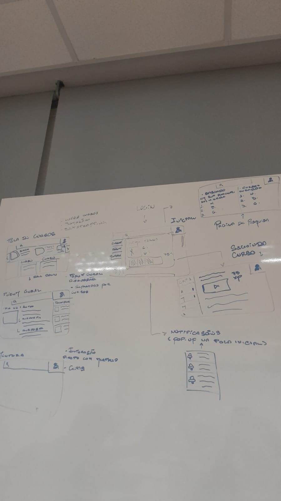
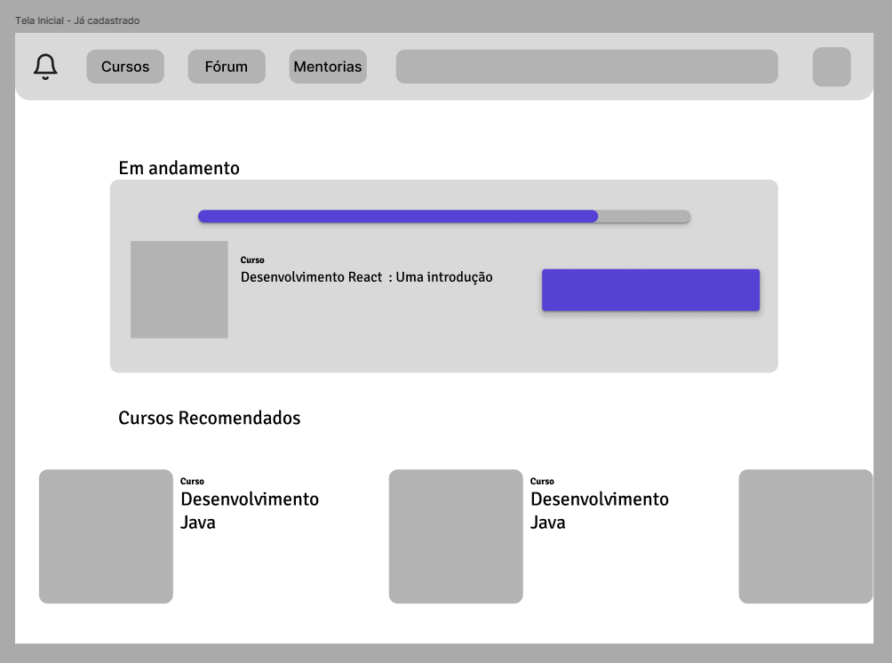
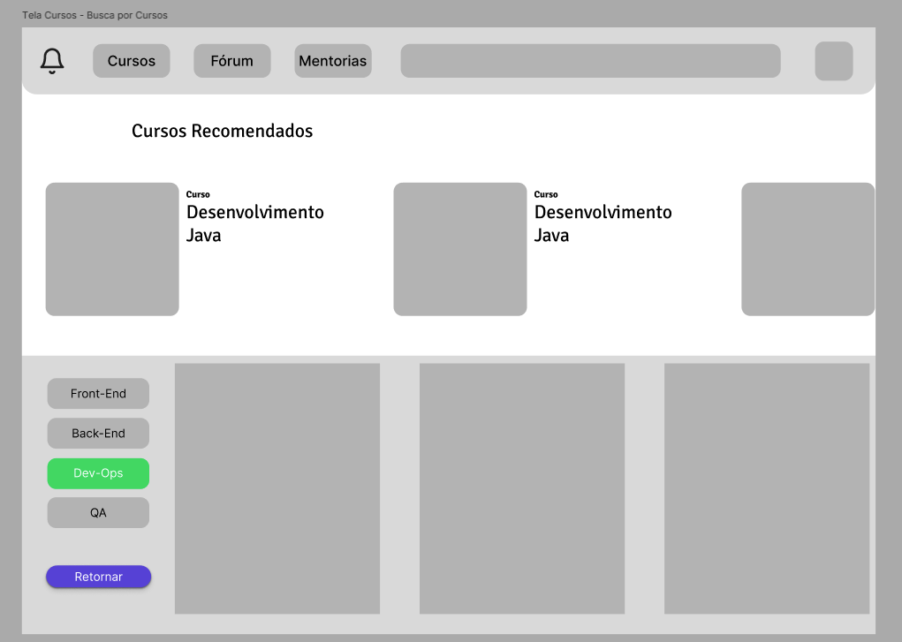
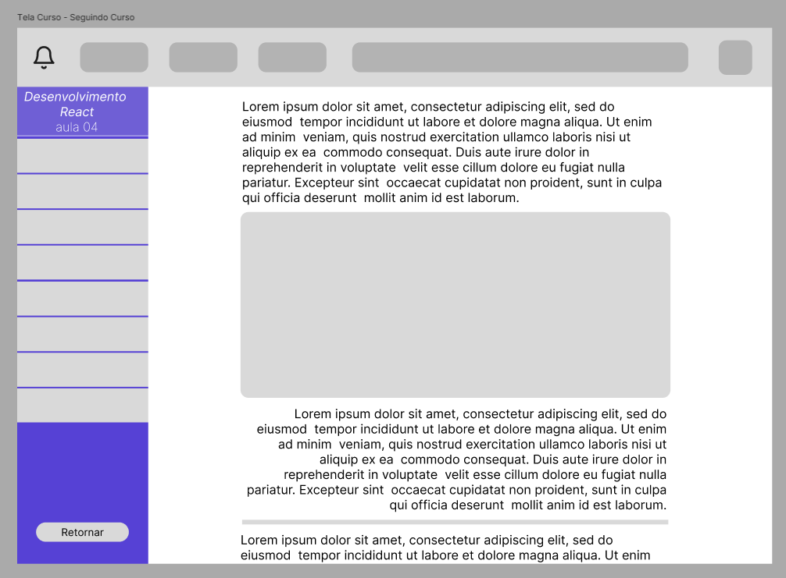
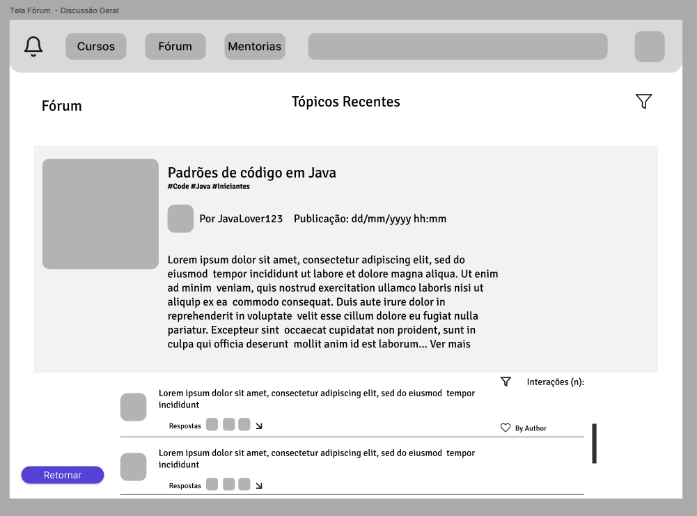
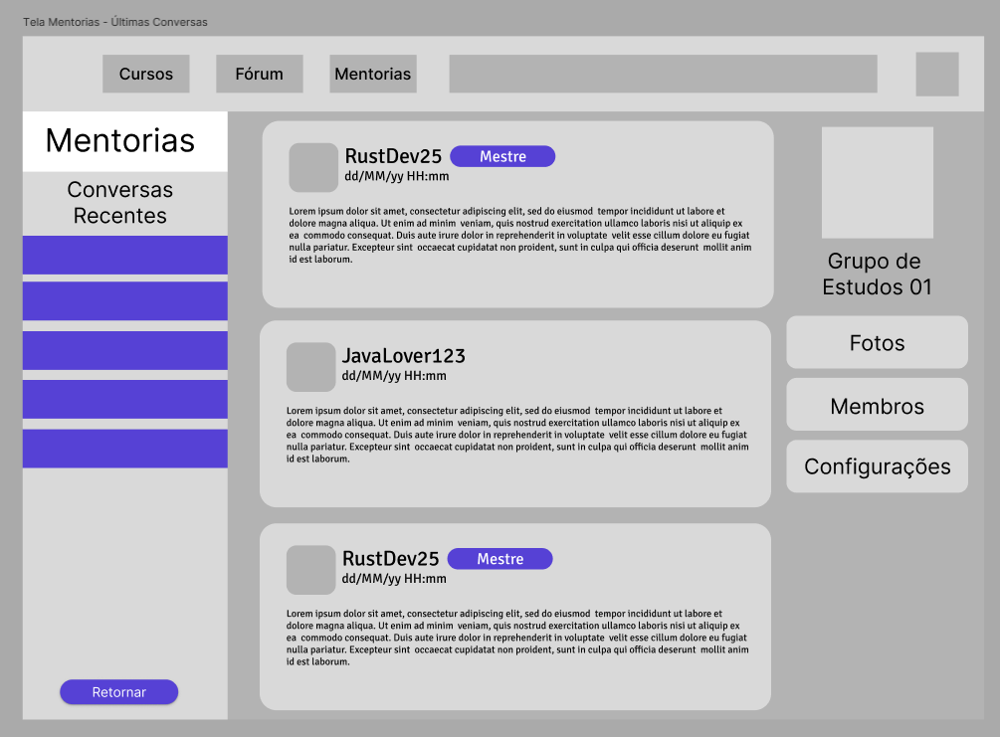
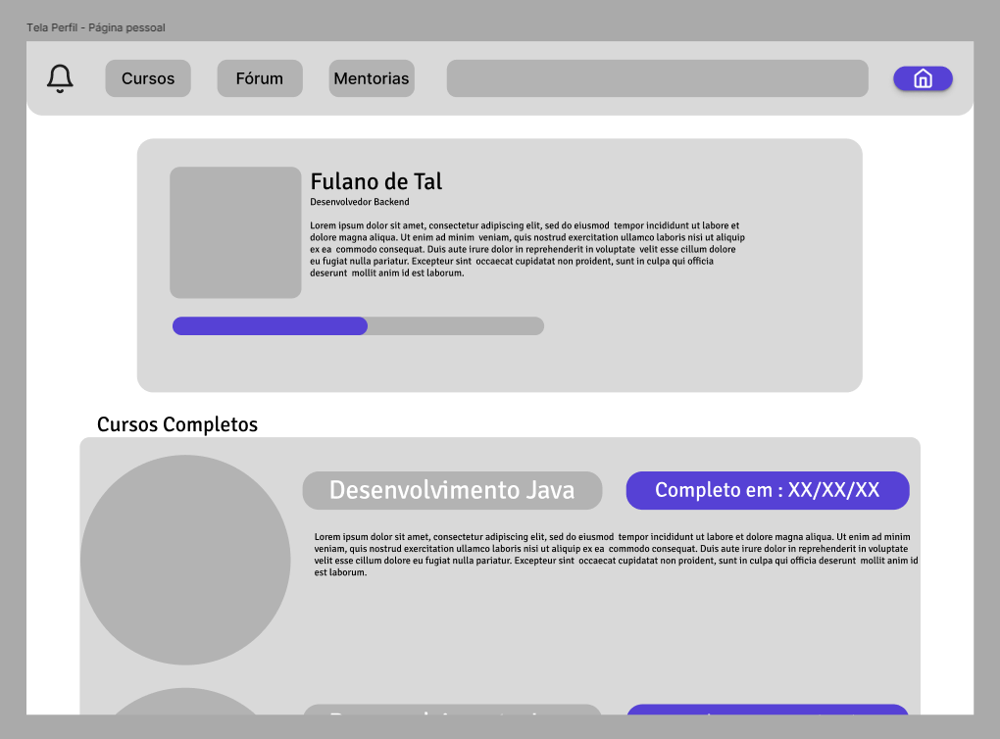

# Relatório Entrega T2 UX
## [29/05/2026][PUCRS]
#### Gabriel Gauterio, Thiago de Souza, Raul Neves, Leonardo Nunes & Marcus Margarites F.

*Plataforma de Qualificação Profissional — maio de 2026*

---

## 1. Introdução

Este trabalho dá continuidade ao T1 da disciplina de Experiência do Usuário (UX) da Escola Politécnica da PUCRS. A partir das personas e cenários construídos na etapa anterior, centrados em jovens adultos brasileiros que buscam qualificação profissional online, este relatório apresenta o processo de prototipação das principais telas da plataforma.

O trabalho percorre as etapas de esboço inicial em papel, estudo de princípios e diretrizes de design, escolha de plataforma-alvo e seleção de padrões de IHC, culminando em protótipos de média fidelidade desenvolvidos no Figma. Para cada tela são indicadas as personas associadas, os princípios seguidos e os padrões de design aplicados. O fluxo de navegação e as mensagens do sistema também são descritos.

---

## 2. Fundamentação

### 2.1 Princípios e Diretrizes Gerais

Os princípios adotados baseiam-se nas **10 Heurísticas de Usabilidade de Jakob Nielsen**, selecionando aqueles com maior impacto direto sobre o perfil dos usuários da plataforma:

| # | Heurística | Aplicação na plataforma |
|---|---|---|
| 1 | **Visibilidade do status do sistema** | Barras de progresso nos cursos em andamento (Tela Inicial e Perfil) deixam claro o quanto o usuário já avançou. |
| 2 | **Compatibilidade com o mundo real** | Linguagem familiar ("Cursos", "Fórum", "Mentorias") e ícones reconhecíveis (sino de notificação, casa para home). |
| 3 | **Controle e liberdade do usuário** | Botão "Retornar" presente nas telas secundárias; navegação global disponível em todas as telas. |
| 4 | **Consistência e padrões** | Barra de navegação (Cursos / Fórum / Mentorias / Busca / Perfil) é idêntica em todas as telas. |
| 5 | **Prevenção de erros** | Filtros de categoria na Busca de Cursos evitam que o usuário navegue por conteúdo irrelevante. |
| 6 | **Reconhecimento em vez de memorização** | Labels visíveis nos botões de navegação; tags e badges ("Mestre") reduzem carga cognitiva. |
| 7 | **Flexibilidade e eficiência de uso** | Filtros avançados (Front-End, Back-End, Dev-Ops, QA) para usuários experientes; recomendações automáticas para iniciantes. |
| 8 | **Design estético e minimalista** | Layout limpo, hierarquia tipográfica clara, uso de cor como acento (roxo/azul) sem sobrecarga visual. |

### 2.2 Plataforma a ser utilizada

A plataforma será desenvolvida para **Web** (desktop/browser), seguindo as diretrizes do **Material Design 3** (Google).

A escolha se justifica pelo perfil das personas: usuários que descobrem cursos majoritariamente pelo Google e por redes sociais, acessando conteúdo em computadores e notebooks durante sessões de estudo. A web elimina a barreira de instalação e facilita o acesso rápido.

**Princípios gerais do Material Design aplicados:**

- **Layout:** Grid de 12 colunas com margens consistentes; cards como unidade principal de conteúdo; hierarquia visual por elevação (shadows) e espaçamento.
- **Cor:** Paleta com roxo (#5B4FCF / #7B6FE8) como cor primária e branco/cinza claro como fundo; cor de destaque (verde, como em filtros ativos) com uso restrito e intencional.
- **Tipografia:** Sans-serif de alta legibilidade (Roboto); títulos em bold, textos de suporte em regular, metadados em lighter — consistente com a hierarquia de leitura esperada para plataformas educacionais.
- **Ícones:** Material Icons para ações padrão (busca, notificação, filtro, curtir); ícones com label textual nas ações principais.
- **Componentes:** Uso de chips para filtros e tags, progress indicators lineares, cards clicáveis, FABs para ações primárias, bottom navigation adaptada para a navbar superior.

### 2.3 Padrões de Design de IHC

Foram selecionados padrões da biblioteca **UI Patterns** (ui-patterns.com), escolhidos com base nas necessidades identificadas nas personas:

#### Padrão 1 — Search Filters (Filtros de Busca)

**Justificativa:** As três personas têm necessidades distintas ao buscar cursos — Gabriel precisa de filtros técnicos por linguagem/área, Beatriz precisa de orientação por área de interesse e Lucas precisa de clareza sobre o que cada curso oferece. Filtros categorizados (Front-End, Back-End, Dev-Ops, QA) permitem que cada perfil encontre conteúdo relevante sem precisar percorrer toda a oferta da plataforma.

**Aplicação:** Tela de Busca de Cursos, sidebar com categorias selecionáveis e highlight visual do filtro ativo.

#### Padrão 2 — Completeness Meter (Indicador de Completude)

**Justificativa:** A motivação de Gabriel é progressão técnica contínua; a de Beatriz é validação do esforço; a de Lucas é resultado concreto. Um indicador visual de progresso atende às três personas ao tornar a evolução mensurável e visível, reforçando o engajamento e reduzindo abandono.

**Aplicação:** Tela Inicial (barra de progresso no curso "Em andamento"), Perfil (barra no card de apresentação do usuário).

#### Padrão 3 — Reputation (Reputação)

**Justificativa:** No contexto de Mentorias, a credibilidade de quem oferece suporte é crítica, especialmente para Beatriz (que precisa de apoio profissional confiável) e Lucas (que precisa de um mentor disponível). O badge "Mestre" identifica visualmente mentores experientes, reduzindo a insegurança antes de iniciar uma conversa.

**Aplicação:** Tela de Mentorias, badge colorido ("Mestre") no card de cada mentor.

#### Padrão 4 — Progressive Disclosure (Divulgação Progressiva)

**Justificativa:** No Player do Curso, exibir todas as aulas de uma vez poderia intimidar usuários como Beatriz e Lucas. A sidebar lista as aulas com numeração e destaca a aula atual, revelando o conteúdo de forma sequencial e estruturada, sem sobrecarregar visualmente.

**Aplicação:** Tela do Player do Curso, sidebar com lista de aulas, aula ativa em destaque (roxo).

---

## 3. Representação da Interface

### 3.1 Esboço Inicial

O esboço inicial foi realizado em quadro branco (whiteboard) durante aula prática em 05/05/2026, antes do estudo formal de princípios. O grupo mapeou as principais telas e o fluxo de navegação entre elas de forma livre.



O esboço identificou as seguintes telas-chave e elementos de interação:

- **Login** como ponto de entrada, com fluxo para a **Tela Inicial** (usuário já cadastrado) ou fluxo de cadastro;
- **Tela de Cursos** com layout de cards e dropdown de filtros;
- **Fórum Global** com busca por usuário/autor, área de tópicos e lista de posts;
- **Seguindo Curso** com sidebar de aulas e área central de conteúdo;
- **Notificações** como pop-up no acesso inicial;
- **Tutora** com interação direta com o professor e chat.

Elementos anotados no esboço incluem: "listas cursos", "sugestões", "sintetizações", "buscas por usuário", "seguindo por curso", "interação direta com professor", "chat".

### 3.2 Telas

A ferramenta utilizada para prototipação foi o **Figma**. Os protótipos são de **média fidelidade** — estrutura visual definida, paleta de cores aplicada, conteúdo representativo (lorem ipsum onde aplicável), sem assets finais.

---

#### Tela 01 — Tela Inicial (Usuário já cadastrado)



**Personas associadas:**
- Gabriel Costa — acompanha o progresso diário no curso em andamento.
- Beatriz Mendes — recebe recomendações de cursos alinhadas ao seu perfil.
- Lucas Oliveira — recebe recomendações de cursos com boa relação custo/benefício.

**Princípios e diretrizes seguidos:**
- *Visibilidade do status do sistema:* barra de progresso no card "Em andamento" exibe o percentual concluído no curso "Desenvolvimento React: Uma introdução".
- *Compatibilidade com o mundo real:* seção "Cursos Recomendados" usa linguagem direta; cards com thumbnail e título reconhecíveis.
- *Consistência:* navbar (Cursos / Fórum / Mentorias / Busca / Perfil) idêntica às demais telas.

**Padrões de design utilizados:**
- **Dashboard** — visão geral do estado atual do usuário ao abrir a plataforma.
- **Completeness Meter** — barra de progresso no curso em andamento.
- **Cards** — cursos recomendados em grid horizontal deslizável.

---

#### Tela 02 — Busca de Cursos



**Personas associadas:**
- Gabriel Costa — usa filtros técnicos (Front-End, Back-End, Dev-Ops, QA) para encontrar conteúdo específico.
- Beatriz Mendes — navega por área de interesse antes de se comprometer com um curso.
- Lucas Oliveira — usa categorias objetivas para avaliar a oferta disponível.

**Princípios e diretrizes seguidos:**
- *Flexibilidade e eficiência de uso:* filtros laterais permitem afunilar a busca por área técnica sem necessidade de texto livre.
- *Prevenção de erros:* destaque visual no filtro ativo (verde) evita confusão sobre qual categoria está selecionada.
- *Reconhecimento em vez de memorização:* seção "Cursos Recomendados" no topo oferece ponto de partida sem exigir que o usuário saiba o que buscar.

**Padrões de design utilizados:**
- **Search Filters** — sidebar com categorias (Front-End, Back-End, Dev-Ops, QA).
- **Categorization** — cursos agrupados por área técnica.
- **Cards** — apresentação dos cursos em grid com thumbnail e título.
- **Thumbnail** — imagem de capa do curso para identificação visual rápida.

---

#### Tela 03 — Player do Curso



**Personas associadas:**
- Gabriel Costa — estuda no próprio ritmo, navegando entre aulas conforme o domínio do conteúdo.
- Beatriz Mendes — consome conteúdo de forma sequencial, aproveitando a estrutura para orientar o aprendizado.
- Lucas Oliveira — usa a sidebar para planejar as sessões de estudo e manter progressão autônoma.

**Princípios e diretrizes seguidos:**
- *Visibilidade do status do sistema:* aula ativa destacada em roxo na sidebar identifica o ponto atual do usuário no curso.
- *Controle e liberdade do usuário:* botão "Retornar" na parte inferior da sidebar; possibilidade de navegar para qualquer aula da lista.
- *Design minimalista:* sidebar ocupa área menor que o conteúdo central, priorizando a área de leitura/vídeo.

**Padrões de design utilizados:**
- **Module Tabs** — sidebar com lista de aulas numeradas agindo como índice do módulo.
- **Progressive Disclosure** — conteúdo da aula revelado ao selecionar o item na sidebar; demais aulas ficam colapsadas.
- **Article List** — lista estruturada de aulas na sidebar com título do curso e número da aula ativa.

---

#### Tela 04 — Fórum (Discussão Geral)



**Personas associadas:**
- Gabriel Costa — participa de tópicos técnicos categorizados por linguagem e nível.
- Beatriz Mendes — busca apoio profissional e conexão com pessoas da área que quer ingressar.
- Lucas Oliveira — encontra suporte de outros usuários ao travar em algum conteúdo.

**Princípios e diretrizes seguidos:**
- *Compatibilidade com o mundo real:* estrutura de tópicos com autor, data/hora e preview de texto segue o padrão esperado em fóruns online.
- *Reconhecimento em vez de memorização:* tags técnicas (#Code, #Java, #Iniciantes) identificam o conteúdo do tópico sem abrir a thread.
- *Flexibilidade:* ícone de filtro (funil) no canto superior direito permite ordenar tópicos.

**Padrões de design utilizados:**
- **Tagging** — tags técnicas (#Code, #Java, #Iniciantes) nos tópicos para filtragem por tema.
- **Activity Stream** — lista de tópicos recentes com autor, timestamp e preview do conteúdo.
- **Reaction** — botão de curtir (coração) e indicador de interações nos posts.

---

#### Tela 05 — Mentorias



**Personas associadas:**
- Gabriel Costa — troca experiências com pares em grupos de estudo.
- Beatriz Mendes — acessa mentores experientes (badge "Mestre") para orientação de carreira.
- Lucas Oliveira — encontra mentor disponível para ajudar quando trava no conteúdo.

**Princípios e diretrizes seguidos:**
- *Visibilidade do status do sistema:* badge "Mestre" identifica o nível/credibilidade do mentor instantaneamente.
- *Consistência:* layout de cards de conversas segue o mesmo padrão visual das demais listagens.
- *Controle e liberdade:* botão "Retornar" e navegação global disponíveis; painel lateral com opções do grupo (Fotos, Membros, Configurações).

**Padrões de design utilizados:**
- **Chat** — área central com histórico de mensagens em cards com avatar, nome e timestamp.
- **Activity Stream** — feed de conversas recentes na sidebar esquerda.
- **Reputation** — badge "Mestre" nos mentores experientes, conferindo credibilidade visual imediata.

---

#### Tela 06 — Perfil (Página Pessoal)



**Personas associadas:**
- Gabriel Costa — registra conquistas e progresso pessoal.
- Beatriz Mendes — valida o esforço investido com o histórico de cursos concluídos.
- Lucas Oliveira — constrói portfólio/currículo verificável com datas de conclusão.

**Princípios e diretrizes seguidos:**
- *Visibilidade do status do sistema:* barra de progresso no card de perfil exibe o nível geral de completude do usuário na plataforma.
- *Design minimalista:* informações organizadas em blocos (dados pessoais → progresso → cursos completos), sem poluição visual.
- *Compatibilidade com o mundo real:* "Completo em: XX/XX/XX" como formato de data familiar e diretamente útil para inserção no currículo.

**Padrões de design utilizados:**
- **Dashboard** — visão consolidada do perfil do usuário (foto, bio, nível, progresso).
- **Archive** — listagem de cursos completos com data de conclusão.
- **Completeness Meter** — barra de progresso indicando o quanto do perfil está preenchido/avançado.

---

### 3.3 Fluxo de Navegação/Interação entre as Telas

```
[LOGIN]
   │
   ├─── Novo usuário ────────────────► [CADASTRO] ──► [TELA INICIAL]
   │
   └─── Usuário cadastrado ──────────► [TELA INICIAL]
                                            │
              ┌─────────────────────────────┼────────────────────────────┐
              │                             │                            │
              ▼                             ▼                            ▼
       [BUSCA DE CURSOS]           [FÓRUM - Lista]              [MENTORIAS - Chat]
              │                             │                            │
              │  ◄── Filtros ──►            │  ◄── Criar tópico          │  ◄── Grupo de Estudos
              │                             │                            │
              ▼                             ▼                            ▼
       [PLAYER DO CURSO]          [FÓRUM - Tópico]          [MENTORIA - Conversa]
              │
              └──► ao completar ──────────► [PERFIL - atualiza progresso]

[ÍCONE DE NOTIFICAÇÃO] ──► [POP-UP de notificações] (qualquer tela)
[ÍCONE DE PERFIL]      ──► [PERFIL]                 (qualquer tela)
```

**Descrição do fluxo principal (happy path — Gabriel):**
1. Gabriel acessa a plataforma e faz login.
2. A Tela Inicial exibe o curso "Desenvolvimento React" em andamento com barra de progresso.
3. Clica no card do curso → abre o Player do Curso na última aula assistida.
4. Navega pelas aulas via sidebar. Ao concluir uma aula, marca como completa.
5. Ao travar em um conceito, acessa o Fórum e busca por tópico com a tag técnica relevante.
6. Retorna à Tela Inicial. Consulta o Perfil para verificar os cursos já completos.

**Fluxo alternativo (Beatriz — orientação antes do compromisso):**
1. Beatriz acessa a plataforma pela primeira vez.
2. Navega até Busca de Cursos e explora por área de interesse, sem filtro técnico específico.
3. Lê o card de descrição de um curso. Decide acessar o Fórum para ver a comunidade antes de comprar.
4. Acessa Mentorias e encontra um Mestre disponível para tirar dúvidas sobre a área.
5. Inicia o curso. Acompanha o progresso no Perfil.

### 3.4 Mensagens do Sistema

As mensagens apresentadas pelo sistema cobrem os estados de feedback esperados em cada interação crítica:

| Contexto | Tipo | Mensagem |
|---|---|---|
| Login — credenciais inválidas | Erro | "E-mail ou senha incorretos. Verifique os dados e tente novamente." |
| Login — conta não encontrada | Erro | "Nenhuma conta encontrada com este e-mail. Deseja criar uma conta?" |
| Cadastro — e-mail já cadastrado | Erro | "Este e-mail já está em uso. Faça login ou recupere sua senha." |
| Cadastro — campos obrigatórios vazios | Alerta | "Preencha todos os campos obrigatórios para continuar." |
| Cadastro — concluído com sucesso | Sucesso | "Conta criada com sucesso! Bem-vindo à plataforma." |
| Aula marcada como concluída | Sucesso | "Aula concluída! Continue para a próxima." |
| Curso 100% concluído | Sucesso | "Parabéns! Você concluiu o curso [Nome do Curso]. Seu certificado está disponível no Perfil." |
| Postagem no Fórum enviada | Sucesso | "Sua mensagem foi publicada com sucesso." |
| Postagem no Fórum — campo vazio | Erro | "Escreva algo antes de publicar." |
| Mensagem de mentoria enviada | Sucesso | (estado visual — balão alinhado à direita, sem toast) |
| Notificação de nova mensagem | Informação | Pop-up: "Você tem [n] nova(s) mensagem(ns) em Mentorias." |
| Notificação de resposta no Fórum | Informação | Pop-up: "Alguém respondeu ao seu tópico: '[título]'." |
| Filtro sem resultados | Alerta | "Nenhum curso encontrado para esta categoria no momento." |
| Carregamento lento / falha de rede | Erro | "Não foi possível carregar o conteúdo. Verifique sua conexão e tente novamente." |

---

## 4. Considerações Finais

O trabalho permitiu ao grupo exercitar o ciclo completo de design de interfaces: do esboço livre em quadro branco à prototipação estruturada com fundamentação teórica. A experiência evidenciou que as personas construídas no T1 são instrumentos práticos — a tabela cruzando telas e personas (apresentada nos slides) forçou o grupo a justificar cada decisão de interface em termos de quem vai usá-la e por quê, em vez de tomar decisões por preferência estética.

A escolha do Material Design como guia mostrou-se adequada para um sistema web: os componentes são amplamente reconhecíveis pelo público-alvo (jovens adultos com experiência digital), o que reduz a curva de aprendizado da plataforma. A seleção de padrões de IHC (Search Filters, Completeness Meter, Reputation, Progressive Disclosure) foi diretamente motivada pelas necessidades distintas das três personas — o que tornou as justificativas mais sólidas do que se a escolha fosse genérica.

O maior desafio foi o fluxo de mensagens: sistematizar os estados de erro, sucesso e alerta exigiu revisitar cada interação crítica da plataforma, revelando situações que o grupo não havia considerado na prototipação inicial (como o estado "filtro sem resultados" e a falha de rede no Player).

Como próximos passos naturais para o projeto, o grupo identificaria: (a) prototipação do fluxo de login/cadastro, ausente nos protótipos atuais; (b) tela de checkout/assinatura, crítica para Lucas dado o peso do custo na decisão; (c) tela de notificações expandida, hoje representada apenas como pop-up.

---

## Referências

- NIELSEN, J. **10 Usability Heuristics for User Interface Design**. Nielsen Norman Group, 1994. Disponível em: https://www.nngroup.com/articles/ten-usability-heuristics/
- GOOGLE. **Material Design 3 — Guidelines**. Disponível em: https://m3.material.io/
- UI PATTERNS. **User Interface Design Patterns**. Disponível em: https://ui-patterns.com/patterns
- TIDWELL, J.; BREWER, C.; VALENCIA, A. **Designing Interfaces: Patterns for Effective Interaction Design**. 3. ed. O'Reilly Media, 2020.
- BUXTON, B. **Sketching User Experiences: Getting the Design Right and the Right Design**. Morgan Kaufmann, 2007.

---

## Apêndice — Uso de IA como Apoio

A inteligência artificial (Claude — Anthropic, modelo Sonnet 4.6, via Claude Code) foi utilizada como apoio em um momento do trabalho.

---

### Uso — Geração da tabela de análise persona × tela (`imagensTelas/criterios.png`)

**Ferramenta:** Claude Code (CLI) — modelo claude-sonnet-4-6  
**Data:** 22/05/2026

**Prompt enviado ao modelo:**

> "Claude, analise as imagens da subpasta 'imagensTelas' e as compare com as especificações de personas no arquivo '.\t1\parte02\personas.md'. Me indique no que acertei e no que errei."

**Processo executado pelo modelo:**

1. Leitura de todas as imagens dos protótipos em `imagensTelas/`;
2. Leitura do arquivo `.\t1\parte02\personas.md` com as especificações das três personas (Gabriel, Beatriz e Lucas);
3. Cruzamento entre os elementos visuais de cada tela e os objetivos práticos declarados de cada persona;
4. Geração de análise indicando quais necessidades de cada persona eram atendidas por cada tela e quais gaps ainda existiam.

**Resposta gerada:**

A resposta do modelo gerou a tabela cruzada (tela × persona) registrada em `imagensTelas/criterios.png`, que mapeia para cada tela do protótipo qual necessidade prática de cada persona é atendida, com a justificativa dos padrões de IHC utilizados como evidência. Esta tabela foi incorporada à apresentação e serviu de base para a seção 3.2 deste relatório.
