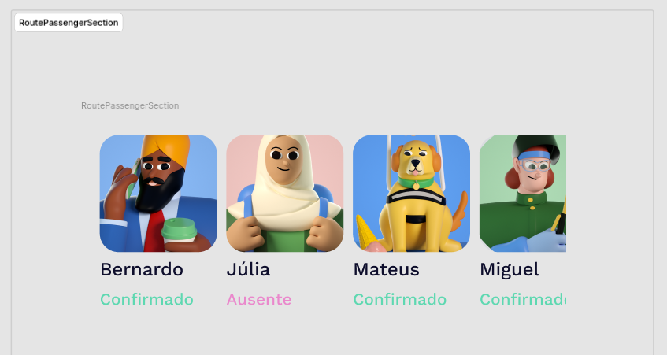
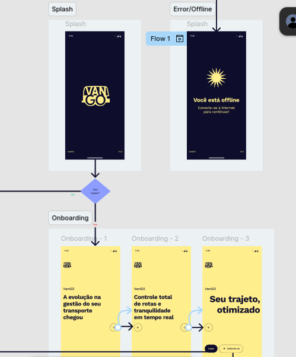
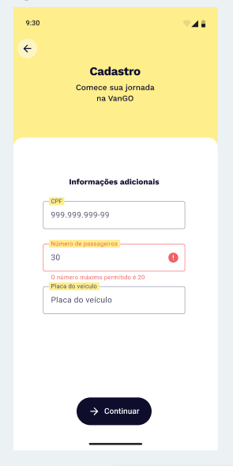
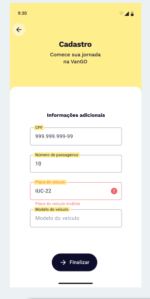
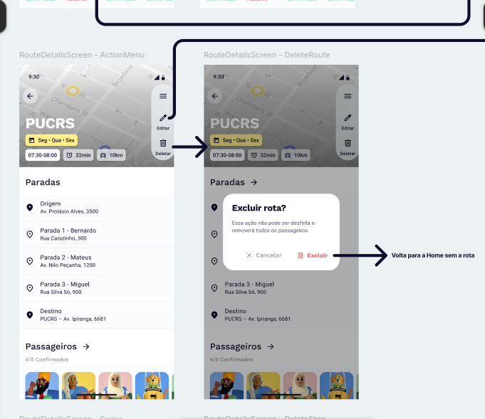
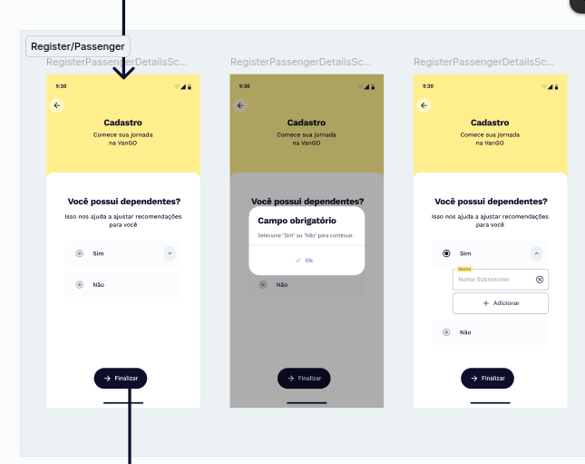
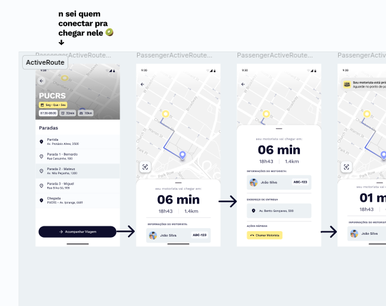
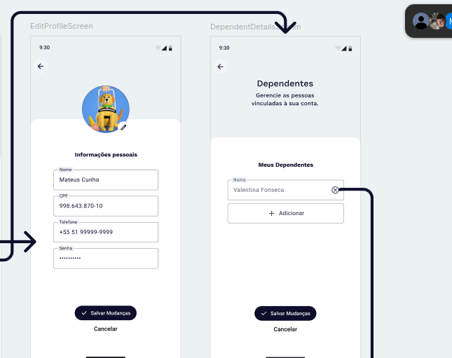

# Experiência do Usuário
## [18-06-2026][mvfm]
---
### T3 - VanGO
- Sala de entrega no Moodle : [**Até dia 23/06**](https://moodle.pucrs.br/mod/assign/view.php?id=3731880)
- Apenas o relatório pessoal, entramos em consenso no mesmo dia, desenvolvendo e argumentando o relatório geral.
- [Página Figma do projeto.](https://www.figma.com/design/13w0dkWDXcBifMi0zH524t/UX---VanGO?node-id=7-11&p=f&t=2XycxTpeXdngF3bT-0)

### Relatório Pessoal
- Marcus Vinicius Freitas Margarites Filho, **18/06/26**.
- [aula22B - Slides de Heurísticas de Nielsen](https://moodle.pucrs.br/pluginfile.php/5736491/mod_resource/content/1/Aula%2022B%20-%20UX-%20Inspe%C3%A7%C3%A3o.pdf)
- [Material teórico complementar.](https://moodle.pucrs.br/pluginfile.php/5736494/mod_resource/content/6/UX_Avaliacao_Observacao.pdf)
---
#### Cover
- Nada a comentar, é simplesmente o material de capa do Figma.
- Não está incluída no fluxo de nenhuma das personas criadas (Driver, Passenger).
---
#### Style Guide
- Da mesma forma, a página serve apenas como referência para o uso de :
	1. Cores
	2. Fontes
	3. Spacing
	4. Type Scale
- Como comentário pessoal : o tom de amarelo escolhido não é muito agradável.

#### Components
- Para ícones, o aplicativo VanGO optou por utilizar o pacote **Material Design 3**, disponibilizado pela Alphabet diretamente pelo Figma.
- É uma escolha bastante padrão, para ser honesto.
- É bem possível que esta percepção decorra de eu estar analisando os componentes fora de seu contexto de uso, mas as cores parecem ter pouco contraste entre si, principalmente na seção '*RoutePassengerSection*'.

- Por isso, acredito que vale mais a pena avaliar o uso destes componentes nas seções de **High-Fidelity** e **Flow**.

> **Heurística :** #8 — Estética e design minimalista · **Severidade :** 2 (Menor)
---
#### High-Fidelity
- Considero mais proveitoso analisar o aplicativo diretamente pelo **Flow**. Por meio dele, acredito conseguir avaliar corretamente o uso dos assets em seu devido contexto.

##### Critérios de avaliação
- Cada problema a seguir é associado a uma das **10 Heurísticas de Nielsen** e classificado segundo a **escala de severidade** (também de Nielsen) :
	- **0** — Não é um problema de usabilidade.
	- **1** — Cosmético : não precisa ser corrigido, a menos que haja tempo disponível.
	- **2** — Menor : correção de baixa prioridade.
	- **3** — Grave : importante corrigir, alta prioridade.
	- **4** — Catastrófico : imperativo corrigir antes do lançamento.

#### Flow
**Problema #01 : Usuário incapaz de iniciar a experiência adequadamente.**
- O primeiro Flow não é, de fato, o primeiro Flow.
	- Ao tentar iniciar o Flow pela suposta tela inicial, o usuário fica impossibilitado de avançar para a segunda tela da experiência — o mesmo ocorrendo em sua alternativa offline.
	
	- É fácil argumentar que se trata apenas de um descuido na própria montagem do protótipo no Figma mas, ainda assim, esta foi minha primeira exposição ao fluxo do aplicativo.

> **Heurística :** #3 — Controle e liberdade do usuário · **Severidade :** 4 (Catastrófico)
> O usuário fica preso, sem saída clara nem caminho para avançar, logo no ponto de entrada da experiência.
---
#### Prototype - Driver

**Problema #02 : Ausência de validação real da quantidade de assentos disponíveis.**
- Embora exista um limite máximo de passageiros (o aplicativo rejeita o valor 30 com a mensagem "*O número máximo permitido é 20*"), não há nenhum mecanismo que comprove que o veículo realmente possui a quantidade informada.
- Na prática, o motorista poderia simplesmente declarar um número de assentos diferente do real, sem qualquer verificação por parte do aplicativo.

> **Heurística :** #5 — Prevenção de erros · **Severidade :** 3 (Grave)
> A capacidade do veículo impacta diretamente a operação e a segurança das rotas; aceitar um valor não verificado abre margem para dados incorretos.

**Problema #03 : Falta de auto-complete no cadastro do veículo.**
- A etapa de cadastro do veículo não oferece ao motorista nenhum sistema de auto-complete ou preenchimento assistido (placa e modelo são inteiramente manuais).
- Isso torna a tarefa repetitiva e propensa a erros, sobretudo em casos de atualização recorrente dos dados do veículo.

> **Heurística :** #7 — Flexibilidade e eficiência de uso · **Severidade :** 2 (Menor)
> Não bloqueia a tarefa, mas a torna lenta e repetitiva, sobretudo para o motorista que atualiza seus dados com frequência.

**Problema #04 : Exclusão de rota sem aviso ao passageiro.**
- Quando o motorista decide deletar uma rota, o passageiro não recebe nenhum aviso de que isso ocorreu — a confirmação "*Excluir rota?*" existe apenas do lado do motorista.
- Este caso reforça um problema compartilhado por ambos os usuários : a dependência exclusiva das notificações do aplicativo, sem uma janela dedicada a eventos recentes.

> **Heurística :** #1 — Visibilidade do status do sistema · **Severidade :** 3 (Grave)
> O passageiro depende da rota e não é informado de uma mudança crítica de estado feita pelo motorista.

#### Prototype - Passenger

**Problema #05 : Pergunta inicial sobre dependentes pode excluir usuários.**
- Logo de início, o VanGO apresenta a janela "*Você possui dependentes?*". O passageiro que não possui nenhum dependente pode ter a impressão de que *não* está apto a utilizar o aplicativo.
- Reconheço que este ponto envolve interpretação pessoal e, portanto, é até certo ponto arbitrário; ainda assim, em discussão com os membros do grupo, ele me pareceu relevante.

> **Heurística :** #2 — Correspondência entre o sistema e o mundo real · **Severidade :** 1 (Cosmético)
> A formulação da pergunta pode induzir um modelo mental equivocado, ainda que o usuário consiga prosseguir selecionando "Não".

**Problema #06 : Fluxo de rota ativa não conectado pelos próprios desenvolvedores.**
- No fluxo '*ActiveRoute*' do passageiro, os próprios desenvolvedores deixaram um comentário no Figma admitindo não saber como conectar o acesso à tela de rota ativa ("*n sei quem conectar pra chegar nele*").
- Ou seja, a entrada para esse fluxo permanece sem ligação definida no protótipo.

> **Heurística :** #1 — Visibilidade do status do sistema · **Severidade :** 3 (Grave)
> A tela de rota ativa é justamente onde o passageiro acompanha o status da viagem (motorista, ETA); sem um ponto de entrada definido, esse acompanhamento fica inacessível.

**Problema #07 : Adição de dependentes sem fluxo associado.**
- Nas configurações do passageiro, a tela "*Meus Dependentes*" exibe um botão "*+ Adicionar*", porém ele não está vinculado a nenhum fluxo no protótipo — apenas a exclusão de um dependente (o ícone de "X") está implementada.
- Pode ser uma limitação restrita ao Figma, mas, da forma como está, o usuário consegue remover dependentes, mas não adicionar novos.

> **Heurística :** #3 — Controle e liberdade do usuário · **Severidade :** 2 (Menor)
> O usuário tem controle parcial sobre seus dependentes : consegue remover, mas não adicionar, o que limita o gerenciamento da própria conta.
